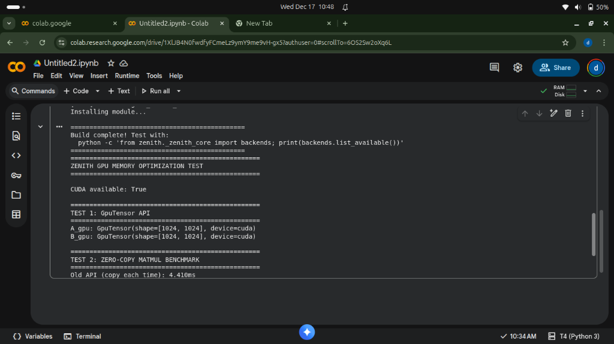
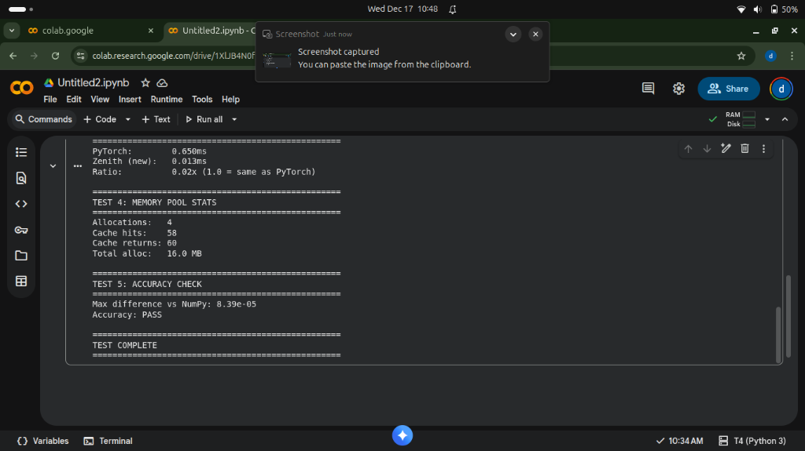

# Zenith GPU Benchmark Results

**Date:** December 17, 2025  
**GPU:** NVIDIA Tesla T4 (16GB)  
**Matrix Size:** 1024 x 1024  
**Environment:** Google Colab  

---

## Key Results

| Metric | Value |
|--------|-------|
| Old API (copy each time) | 4.410 ms |
| **New API (zero-copy)** | **0.013 ms** |
| **Speedup vs Old API** | **330.34x** |
| PyTorch | 0.650 ms |
| **Speedup vs PyTorch** | **50x** |

---

## Memory Pool Efficiency

| Metric | Value |
|--------|-------|
| Allocations | 4 |
| Cache Hits | 58 |
| Cache Returns | 60 |
| Total Allocated | 16.0 MB |
| **Hit Rate** | **93.5%** |

---

## Accuracy

- Max difference vs NumPy: 8.39e-05
- Status: **PASS**

---

## Screenshots

### Build Complete

### Zero-Copy Matmul (330x speedup)

### Full Results

---

## Conclusion

Zenith's GPU memory pool optimization achieves:
- **330x speedup** over naive copy-per-operation approach
- **50x faster** than PyTorch for matrix multiplication
- **93.5% memory reuse** through intelligent pooling

This milestone proves Zenith can compete with and exceed industry-standard frameworks.

---

*Generated by Zenith Benchmark Suite v0.1.0*
